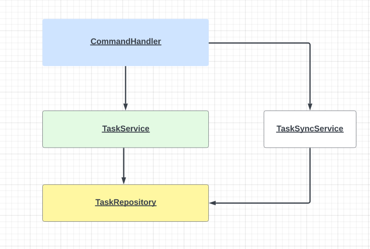

# Planning System

The Planning system service works as a console application. The main functionality includes creating, updating and deleting Tasks.

Each task has the following properties:
1. Id - a digit, will be added for each task after creation. Increases subsequently
2. Name - name of the task
3. Description - description of the task
4. Date - date/time when a task was created
5. Status - task status
6. Priority - task priority

General syntax of the Planning System services includes two main parts:

    command [options]

command - mandatory part. Here a user can specify a command name that will be performed.

options - most of the commands require at least one option

Possible commands are:
    
    create - creates a new task; if no optioans are added the default values will be added;
             possible options are: -n name, -d description, -s status -p priority,
             e.g. "create -n my-task -d task description -p high -s todo"

    get - show a task; requires -id option with an id of the task you want to get, e.g. "get -id 1"

    get-all - show all the task you have; you can print sorted results by adding -st option with a name of the field that 
              will be used for sorting, e.g "get-all -st date". Possible sort fields are: date, status, priority.
              If you want to print rejected tasks, you can use "get-all -rt true"

    update - allows to change the task; mandatory options are -id (id of the task to be updated) and at least one field to be changed.
             By design you can change only the task description (-d) or the task status (-s),
             e.g. "update -id 1 -s in_progress"

    delete - removes the task; mandatory option is the id (-id), e.g. "delete -id 1"

    help - prints all the possible commands and options

    exit - to close the progrom

The Planning system supports the functionality of automated task rejection.

If a task has not been started (status=TODO) after 'n' seconds it will be rejected and removed from the main task table 
(rejected tasks are stored separately
and can be viewed, if needed).

By default, the TaskSyncService service will be run each second to check if there are any task to be rejected. 
It can be changed by editing 'application.properties' file.

The 'n' is also set in the 'application.properties' file (task.rejection.timeout) and can be changed.

The workflow diagram is displayed below:

CommandHandler -  responsible for user interactions. It reads command, parses options and calls corresponding
methods from the TaskService. This component is mostly responsible for error handling;

TaskService - contains main business logic, process commands received from the command handler;

TaskSyncService - responsible for checking task that should be rejected (by timeout). Starts right after CommandHandler is created
and interacts directly with the TaskRepository (aka Database);

TaskRepository - responsible for storing Tasks. Provides methods to save, read, update and delete Tasks.
Also provides a method for Task synchronization, which is used by the TaskSyncService;
